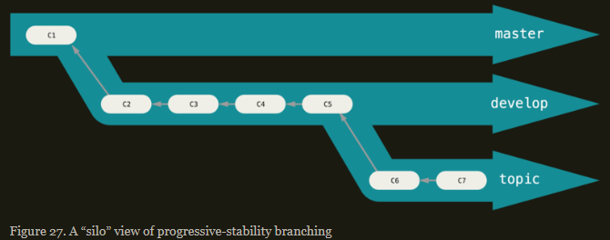
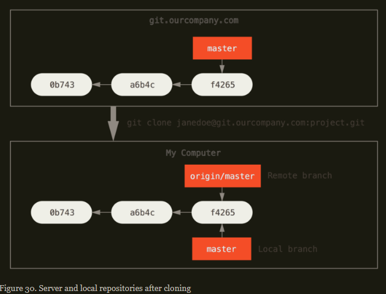
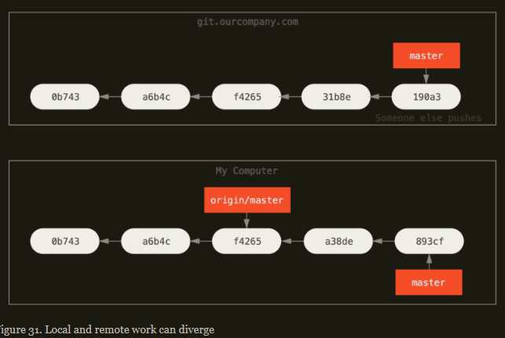
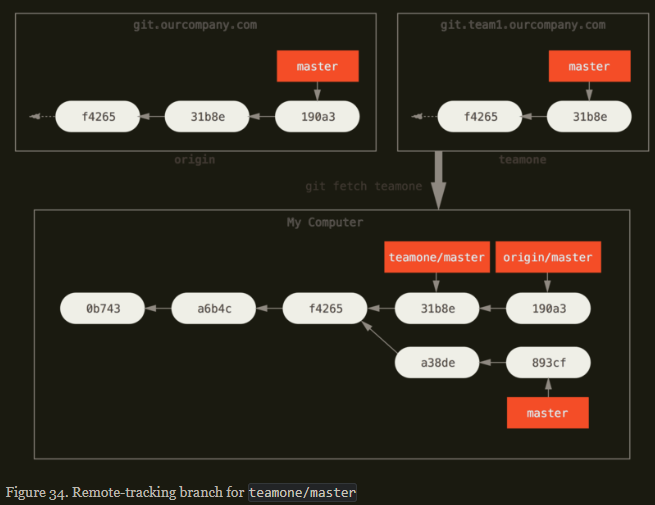

# **TABLE OF CONTENTS**


* [2.2	Recording Changes to Repository](#Chapter2.2)
* [3.5	Remote Branches](#Chapter3.5)


# 2.2 - Recording Changes to the Repository {#Chapter2.2}

* _NOTE: Having a `checkout` on your local machine -> working copy of all files in a Git repository_
* Typically, you'll want to start making changes and committing snapshots of those changes into your repository each time the project reaches a state you want to record.
* Each file in your working directory can be in one of two states:
	* **Tracked** - Files that were in the last snapshot, as well as any newly staged files; they can be unmodified, modified, or staged. Trackes files are files that Git knows about.
	* **Untracked** - Everything other than tracked files - Any files in your working directory that were not in your last snapshot and not in your staging area. Git won't start including it in your commit snapshots until you explicitly tell it to do so.
* As you edit files Git seems them as modified, because you've changed them since your last commit. As you work, you selectively stages these  modified files and then commit all those staged changes, and the cycle repeats.


## Checking the Status of your Files

`git status` - To get which files are in which state. If you run this command directly after a clone, you should see a clean working directory - none of your tracked files are modified. The command tells you which branch you are on, and informs you that it has not diverd from the same branch on the server. 

```
$ git status
```

After you add a file to your project, a simple `README` file. If this file didn't exist before and you run `git status`, you see your untracked file under the "Untracked Files" heading in your status output. 

## Tracking New Files

`git add` - In order to begin tracking a new file. It takes a path or a directory; if its a directory, the command adds all the files in that directory recursively. IT means "add precisely this content to the next commit". For instance, to begin tracking the `README` file run

```
$ git add README
```

If you run status command again, you can see that your README file is now tracked and staged to be committed. You can tell it's staged because it appears under "Changes to be committed" heading. If you commit at this point, the version of the file at tht time you ran `git add` is what will be in the subsequent snapshot. 

## Staging Modified Files

Lets change a file that was already tracked. If you change a previously tracked file called CONTRIBUTING.md and then run your git status command again, you will see the file appears unders a section "Changes not staged for commit" - which means that a file that is tracked has been modified in the working directory but not yet staged. To stage it, you run the `git add` command.  After staging the file if we make another change to the same file, it will list as both staged and unstanged. It turns out that Git stages a file exactly as it wis when you run the `git add` command. If you commit now, the version of `CONTRIBUTING.md` as it was when you last ran the `git add` command is how it will go into the commit, not the version of the file as it looks in your working directory when you run `git commit`. If you modify a file after you run `git add`, you have to run `git add` again to stage the latest version fo the file.

## Short Status

* `git status -s` command shows changes in more compact way. The output has 2 columns - The left-hand column indicates the status of the staging area and the right-hand column indicates the status of the working tree.

* Symbols denote:
	* `??` - Untracked files
	* `A` - files that have been added to staging area
 	* `M` - Modifid files
    * `MM` - Files that have been staged and unstaged changes

## Ignoring File

* For files which you don't want Git to automatically add or even show as being untracked (such as log files or files produced by the build system - You can create afile listing patterns to match them names `.gitignore`.

* Rules for the patterns you can put in the `.gitignore` file are :

	* Blank line(s) are starting with `#` are ignored.
	* Standard glob patterns work, and will be applied recursively throughout the entire working tree.
	* You can start patterns with a forward slash (`/`) to avoid recursively
	* You can end patterns with a forward slash (`/`) to specify a directory
	* You can negate a pattern by starting it with an exclamation point (`!`).

* Glob patterns are simplified regular expressions that shells use. 

	* An asterisk (`*`) matches zero or more characters
	* `[abc]` matches any character inside the brackets (in this case a, b, or c)
	* `?` - matches a single character
	* Brackets enclosing characters separated by a hyphen (`[0-9]`) matches any character between them (in this case 0 through 9).
	* You can use 2 * to match nested directories (`a/**/z` would match `a/z`, `a/b/z`, `a/b/c/z` and so on).

	Its is also possible to have additional `.gitignore` files in subdirectories of tthe repository. The rules in these nested `.gitignore` files apply only to the files under the directory where they are located. 

## Viewing Your Staged and Unstaged Changes

* When you wnat to know exactly what you changed, not just which files were changed - you can use the `git diff` command. 

* It is used to get information about:

	* What have you changed but not yet staged?
	* What have you staged that you are about to commit

* `git status` answers those questions very generally by listing the file names, `git diff` shows you the exact lines added and removed - the patch.

* To see what you've changed but not yet staged, type `git diff` with no argument

```
$ git diff
```

The command compares what is in your working directory with what is in your staging area. The result tell you the chagnes you've made that you haven't yet staged.

* If you want to see what you've staged that will go into your next commit use the command `git diff --staged`. This command compares your staged changed to your last commit.

```
$ git diff staged
```

* `git diff` shows you only the changes that are still unstaged, not the changed made since your last commit. If you've staged all of your changes, it will give no output.

* You can also use `git diff` to see the changes in the file that are staged and the changes that are unstaged. 

* You can run `git difftool` instead of `git diff` to view any diffs in software like vimdiff.

## Committing Your Changes

* Anything that is unstaged (any files you have created or modified that you haven't run `git add` on since you edited them) won't go into this commit. They will stay as modified files on your disk.

* Type `git commit` would open an editor of choice and will show a default template of a commit message, which is commented out and will be ignored (using #). You can add your message after this, and keep this intact so that it will help you remember what you're committing. You can put `-v` option to the `git commit` command for add the diff of your change in the editor.
* You can use `-m` flag with `commit` command so that you can type your commit message inline with `commit` command.

```
$ git commit -m "Story 182: Fix benchmarks for speed
```

* Everytime you perform a commit, you are recording a snapshot of your project 

## Skipping the Staging Area

* Adding a `-a` option to the `git commit` command makes Git automatically stage every file that is already tracked before doing the commit, letting you skip the `git add` part
  
## Removing Files

* To remove a file from Git, you have to remove it from your tracked files and then commit. This can be done using `git rm` command, and also removed the file from your working directory so you don't see it as an untracked file the next time around. 

* If you simply remove the file from your working directory, it shows up under the "Changes not staged for commit" (unstaged) area of `git status`.

* But if you run `git rm` it stages the file's removal. The next time you commit, the file will be gone and no longer tracked. If you modifed the file or had already added it to the staging area, you much force the removal with the `-f` option. 

* You may want to keep the file on your hard drive but not have Git track it anymore. This is useful if you forget to add something to your `.gitignore` file and accidentally staged it. To do this, use the `--cached` option:

```
$ git rm --cached README
```

* You can pass files, directories, and file-glob patterns to the `git rm` command. 

```
$ git rm log/\*.log
```

This command removes all files that the `.log` extension in the `log/` directory. (Backslash (`\`) in front of the `*`).

## Moving Files

* If you want to rename a file in Git you can run 

```
$ git mv file_from file_to
```

This is equivalent to running something like:

```
$ mv file_from file_to
$ git rm file_from
$ git add file_to
```

# 2.3 - Viewing the Commit History

* `git log` - To view the several commits made. By default with no arguments it will list the commits made in that repository in reverse chronological order (most recent commits will show up first) along with the SHA-1 checksum, the author's name and email, the date written and the commit message

```
$ git log
```

* `-p` or `--patch` - Shows the difference (the **patch** output) introduced in each commit. It shows the same information but with a diff directly following each entry. This is very helpful for code review or to quickly browser what happened during a series of commits that a collaborator has added. 

`-2` - Limits the number of log entries displayed to 2

```
$ git log -p -2
```

* `--stat` - See some abbreviated stats for each commit. It prints below each commit a list of of modified files, how many files were changed, and how many lines in those files are added and removed. It also puts a summary of the information at the end. 

```
$ git log --stat
```

* `--pretty` - Changes the log output to formats other than the default. 

	* The `oneline` value for this option prints prints each commit on a single line, which is useful if you're looking at a lot of commits
	* `short`, `full`, `fuller` - Show the output in less or more information
	* `format` - Allows you to specify your own log output format. This is especially useful when you're generating output for machine parsing - because you specify the format explicitly, you know if won't change with updates to Git:

```
$ git log --pretty=oneline
```

```
$ git log --pretty=format:"%h - %an, %ar : %s"
```

(Note - Author is the person who originally wrote the work, whereas the committer is the person who last applied the work. If you send in a patch to a project and one of the core members applies the patch, both of you get credit - you as the author, and the core member as the committer)

* `--graph` - It adds a ASCII graph showing your branches and merge history

```
$ git log --pretty=format:"%h %s" --graph
```

## Limiting Log Output

* `-<n>` - if n is an integer, this option shows the last `n` commits

* `--since` and `--until` - Gets the list of commits made in the last two weeks

```
$ git log --since=2.weeks
```

* `--author` - Allows you to filter on a specific author

* `--grep` - Lets you search for keywords in the commit messages.

* `-S` - Takes a string and shows only those commits that changed the number of occurences of that strings. For instance, if you wanted to fined the last commit that added or removed a reference to a specific function, you could call:

```
$ git log -S function_name
```

* `--` - Filter as a path. If you specify a directory or file name, you can limit the log output to commits that introduces a change to those files. This is always the last option and is generally preceded by double dashes (--) to separate the paths from the options:

```
$ git log -- path/to/file
```

# 2.4 Undoing Things

* If you make a commit too early and possibly forget to add some files, or you mess up your commit message, and you want to redo that commit, make the additional changes you forgot, stage them, and commit again using the `--amend` option - This command takes your staging area and uses it for the commit. If you've made no changes since your last commit (for example, you run the this command immediately after your previous commit), then your snapshot will look exactly the same and all you'll change is your commit message. 

```
$ git commit --amend
```

Only amend commits that are still local and have not been pushed somewhere. Amending previously pushed commits and force pushing the branch will cause problems for your collaborators.

## Unstaging a Staged File

* Let's say you've changed two files and want to commit them as two separate changes, but you accidentally type `git add *` and stage both of them. To unstage a file (file will become just a modified file) you can run the command:

_OLD METHOD_
```
$ git reset HEAD <filename>
```

_NEW METHOD_
```
$ git restore --staged <filename>
```

## Unmodifying a Modified File

* If you don't want to keep your changes to a file, run the following command ot unmodify it (the file will return back to what it looked like whne you last committed or initially cloned)

_OLD METHOD_
```
$ git checkout -- <filename>
```

_NEW METHOD_
```
$ git restored --staged <filename>
```

# 2.5 - Working with Remotes

* Remote Repositories are versions of your project that are hosted on the Internet or network somewhere with read-only or read-write for you. 

## Showing your Remotes

* `git remote` - To see which remote servers you have configured. It lists the shortnames of each remote handle you've specified. If you've cloned your repository, you should at least see `origin` - that is the default name Git gives to the server you cloned from.

* `-v` option - Shows you all the URLs that Git has stored for the shortname to be used when reading and writing to that remote, or all the URLs in case of multiple remotes

```
$ git remote -v
```

## Adding Remote Repositories

* `git remote add <shortname> <url>` - To add a new remote Git repository as a shortname you can reference easily

## Fetching and Pulling from your Remotes

* `git fetch <remote>` - Get all the data that the remote project has but you don't have yet. After you do this, you should have references to all the branches from that remote. 

* If you clone a repository, the command automatically adds that remote repository under the name 'origin'. So `git fetch origin` fetches any new work that has been pushed to that server since you cloned (or last fetched from) it. It only downloads the data to your local repository - it doesn't automatically merge it with any of the work or modify what you're currently working on.

* If your current branch is set up to track a remote branch, you can use `git pull` command to automatically fetch and then merge that remote branch into your current branch. By default, the `git clone` comand automatically sets up your local `master` branch to trach the remote `master` branch on the server you cloned from. Running `git pull` generally fetches data from the server you originally cloned from and automatically tries to merge it into the code you're currently working on.

## Pushing to your Remotes

* When you have your project that you want to share, you have to push it upstream. The command is `git push <remote> <branch>`

* This command only works if you have cloned from a server to which you have write access and if nobody has pushed in the meanwhile. If you and someone else clone at the same time and they push upstream and then you push upstream, your push will be rejected. You will have to fetch their work first and incorporate it in yours before you will be allowed to push. 

## Inspecting a Remote

* `git remote show <remote>` - Show information about a particular remote. It lists the URL for the remote repository as well as the tracking branch information. If you are on the master branch and you run `git pull`, it will automatically merge the remote's `master` branch into the local one after it has been fetched. It also lists all the remote references it has pulled down. It also shows which branch is automatically pushed to when you run `git push` while on certain branches. 

# Renaming and Removing Remotes

* `git remote rename <original_name> <new_name>` - Rename a remote's shortname from original_name to new_name.

* `git remote rm <shortname>` - Remove a remote shortname 


# CHAPTER 3 - GIT BRANCHING

# Branches in a Nutshell

* Branching means you diverge from the main line of development and continue to work without messing with that main line. 

* When you make a commit, Git stores a commit object that contains a pointer to the snapshot of the content you staged. This object also contains the author's name and email address, the message that you typed, and pointers to the commit or commits that directly came before this commit (parent). 

	* Let's say you have a directory containing three files, and you stage them all and commit. Stagin the file computes a checksum for each one (the SHA-1 hash), stores the version of each file in the Git repository (blobs), and adds that checksum to the staging area.
	* When you create the commmit by running `git commit`, Git checksums each subdirectory (in this case, the root project directory), and stores them as a tree object in the Git repository. Git then creates a commit object that has the metadata and a pointer to the root project tree so it can re-create that snapshot when needed. The Git repository now has 5 objects: three blobs (each representing the contents of one of the three files), one tree that lists the contents of the directory and specifies which file names are stored as which blobs, and one commit with the pointer to that root tree and all the commit metadata 
	
	* If you make some changes and commit again, the next commit stores a pointer to the commit that came immediately before it.

	* A branch in Git is simply a movable pointer to one of these commits. The default branch name in Git is `master`. As you start making commits, you are given a `master` branch that points to the last commit you made. Every time you commit, the `master` branch pointer moves forward automatically

# Creating a New Branch

* When you create a new branch, you are creating a new pointer for you to move around. You can do this using the command `git branch <branchname>`.  This creates a new pointer to the same commit you're currently on. 

* How does Git know which branch you're currently on? It keeps a special pointer called `HEAD`. In Git, this is a pointer to the local branch you're currently on. You can see this by running:

```
$ git log --oneline --decorate
```

# Switching Branches

* To switch to an existing branch run the `git checkout <branchname>` command. This moves `HEAD` to point to the new branch.

* If you make further commits, the new branch will move forward, but your master branch still points to the commit you were on when you ran `git checkout` to switch branches. 

* If you switch back to `master` branch, the HEAD pointer moves back to point to the `master` branch and it reverst the files in your working directory back to the snapshot that `master` points to. It essentially just rewinds the work you've done in your testing branch so you can go in a different direction. 

* When you create and switch to a branch, did some work on it, and then switched back to the main branch and did some other work. Both of these changes are isolated in separate branches: you can switch back and forth between the branches and merge them together when you're ready.

* Run `git log --oneline --decorate --graph --all` to print out the history of your commits, showing where your branch pointers are and how your history has diverged. 

* You can use `git switch` instead of `git checkout`

# Basic Branching and Merging

* Let's say you are working on your project and have a couple of commits already on the `master` branch. You've decided to work on issue#53. So you create a new branch and switch to it.

```
$ git checkout -b iss53
```

* You work on your website and make some commits. Doing so moves the `iss53` branch forward, because you have it checked out (that is, your HEAD is pointing to it).

* Now you get a call that there is an issue with the website, and you need to fix it immediately. So you have to switch to the `master` branch (Before doing that if your working directory or staging area has uncommited changes that conflict with the branch you're checking out, Git won't let you switch branches. It's best to have a clean working state when you switch branches. So first commit all the changes made in the new branch and then checkout to `master`).

* When you switch branches, Git resets your working directory to look like it did the last time you committed on that branch. Now you create a `hotfix` branch on which to work until its completed. You can run your tests, make sure the hotfix is what you want, and finally merge the `hotfix` branch back into your `master` branch to deploy to production with `git merge` command

```
$ git checkout master
$ git merge hotfix
```

* Because the hotifx you merged in was directly ahead of the commit you are on, Git simply moves the pointer forward. When you merge one commit with a commit that can be reached by following the first commit's history, Git simplifies things by moving the pointer forward because there is no divergent work to merge together - this is called a "fast-forward".

* After the fix is deployed, you are ready to switch back to the work you were doing before you were interrupted. But first you'll delete the `hotfix` branch as you no longer need it - the `master` branch points at the same place. Run the command

```
$ git branch -d hotfix
```

* Now you can swtich back to your work-in-progress branch on issue#53 and continue working on it. Its worth noting here that the work you did in your `hotfix` branch is not contained in the files in your `iss53` branch. If you need to pull it in, you can merge your `master` branch into your `iss53` branch by running `git merge master` or you can wait to integrate those changes until you decide to pull the `iss53` branch back into `master` later.

# Basic Merging

* Suppose you've decide that your issue#53 work is completed and readly to be merged into your `master` branch. In order to do that, you'll merge your `iss53` branch into `master` using `git merge` command

```
$ git checkout master
$ git merge iss53
```

* Since your development history has merged from some older point, and the commit on the branch you are on isn't a direct ancestor of the branch you're merging in, Git has to do some work. Git creates a new snapshot that results from the three-way merge (two snapshots pointed to by the branch tips, and the common ancestor of the two) and automatically creates a new commit that points to it. This is referred to as a merge commit, and is special in that is has more than one parent. 

* Now that your work is merged in, you have no further need for the `iss53` branch. You can close the issue and delete the branch

# Basic Merge Conflicts

* If you have changed the same part of the same file differently in the two branches you're merging (or fix for issue#53 modifies the same part of a file as `hotfix` branch), Git won't be able to merge them cleanly. Git pauses the process while you resolve the conflict. 

* If you want to see which files are unmerged at any point after a merge conflict, you can run `git status`. Anything that has merge conflicts and hasn't been resolved is listed as unmerged. Git adds standard conflic-reseolution markes to the files that have conflicts, so you can open them manually and resolve those conflicts. 

* For example, the version in `HEAD` (your `master` branch because that was what you had checkout out when you ran your merge command) is the top part of the block (everything above the `=======`), while the version in your `iss53` branch looks like everything in the bottom part. You have to replace everything within the lines containing `<<<<<` and `>>>>>>>` (including them) in each of the conflicting files. After that you run `git add` on each file to mark it as resolved. You can run `git status` again to verify that all conflicts have been resolved.

* After staging your merge conflict resolutions, you can type `git commit` to finalize the merge commit.

# Branch Management

* `git branch` - Get a list of your current branches

`*` character prefixes the branch that you are currently checked out to (that is, the branch the `HEAD` points to). This means if you commit at this point, that branche will be moved forward with you new work. 

* `git branch -v` - See the last commit on each branch

* `--merged` and `--no-merged` - Filter the list of branches to the ones which have or have not been merged yet into the branch that you are currently on. If you run `git branch --merged`, the list of branches without `*` prefix are generally fine to delete because you have already incorporated their work into another branch, so you are not going to lose anything.

* Trying to delete a branch in the list provided by `git branch --no-merged` will fail and will have to be forced because you will lose the work done on this branch. 

## Changing a Branch Name

* To rename a branch locally run `git branch --move` command

```
$ git branch --move bad-branch-name corrected-branch-name
```

* To see the corrected branch on the remote, push it:

```
$ git push --set-upstream origin corrected-branch-name
```

* The branch with the bad name is also present if you run `git branch --all`, but you can delete it

```
$ git push origin --delete bad-branch-name
```

## Changing the master branch name

* To rename your local `master` branch into `main`, run

```
$ git branch --move master main
```

* To let others see the new `main` branch, you need to push it to the remote. 

``` 
$ git push --set-upstream origin main
```

* After you make certain that the `main` branch performs just as the `master` branch, you can delete the `master` branch

```
$ git push origin --delete master
```

# Branching Workflows

## Branching Workflows

### Long Running Branches

* Many Git developers have a workflow that embraces this approach, such as having only code that is entirely stable in their `master` branch - code that has been or will be released. They have another parallel branch named `develop` that they work from or use to test stability, and whenever ite gets to a stable state, it can be merged into `master`. Its used to pull in topic branches when they are ready, to make sure they pass all the tests and don't introduce bugs. Some larger projects also have a `proposed` branch that has integrated branches that may not be ready to go into the `next` or `master` branch. The idea is that your branches are at various levels of stability; when they reach a more stable level, they're merged into the branch above them. 



### Topic Branches

* A topic branch is a short-lived branch that you create and use for a single particular feature or related work. For eg. the `iss53` and `hotfix` branches. You did few commits on them and directly after merging them into your main branch. This technique allows you to context-switch quickly and completely.

# 3.5 - Remote Branches{#Chapter3.5}

* Remote references are references (pointers) in your remote repositoreis, including branches, tags and so on. You can get a full list of remote references explicitly with `git ls-remote <remote>` or `git remote show <remote>` for remote branches as well as more information. 

* Remote tracking branches are references to the state of remote branches. They are local references that you can't move. Git moves them for you whenver you do any network communication, to make sure they accurately represent the state of the remote repository. Think of them as bookmarks, to remind you where the branches in your remote repositories were the last time you connected to them.

* Remote-tracking branch names take the form `<remote>/<branch>`. If you wanted to see what the `master` branch on your `origin` remote looked like as of the last time you communicated with it, you would check the `origin/master` branch. 

* Let's say you have a Git server on your network at `git.ourcompany.com`. If you clone from this Git's `clone` command automatically names it `origin` for you, pulls down all its data, creates a pointer to where its `master` branch is, and names it `origin/master` locally. Git also gives you your own local `master` branch starting at the same place as origin's `master` branch, so you have something to work from.



* If you do some work on your local `master` branch, and in the meantime, someone else pushed to `git.ourcompany.com` and updates its `master` branch, then your histories move forward differently. Also, as long as you stay out of contact with your `origin` server, your `origin/master` pointer moves nowhere.



* To sync your work with a given remote, you run a `get fetch <remote>` command (in our case, `git fetch origin`). This command looks up which server `origin` is (in this case, its `git.ourcompany.com`), fetches any data from it that you don't have yet, and updates your local database, moving your `origin/master` pointer to its new, more up-to-date position.


* Let's assume you have another internal Git server that is used only for development by one of your sprint teams. This server is at `git.team1.ourcompany.com`. You can add it as a new remote reference to the project you are currently working on by running the `git remote add` command. Name this remote `teamone` which will be the shortname for that whole URL.

* Now you can run `git fetch teamone` to fetch everything the remote `teamone` server has that you don't have yet. because that server has a subset of the data you `origin` server has right now, Git fetches no data but sets a remote-tracking branch called `teamone/master` to point to the commit that `teamone` has as its `master` branch. 



## Pushing

* When you wwant to share a branch with the world, you need to push it to a remote to which you have write acess. Your local branches aren't automatically synced to the remote you write to - you have to explicitly push the branches you want to share. That way, you can use private branches for work you don't want to share, and push up only the topic branches you want to collaborate on.

* If you have a barnch named `serverfix` that you want to work on with others, you can push it up the same way you pushed the first branch. Run `git push <remote> <branch>`. So in our case

```
$ git push origin serverfix
```

* If you want to push a local branch into a remote branch that is named differently, you can run instead `git push origin serverfix:awesomebranch` to push your local `serverfix` branch to the `awesomebranch` branch on the remote project.

* When you do a fetch that brings down new remote-tracking branches, you don't automatically have local, editable copies of them. You don't have a new `serverfix` branch - you only have an `origin/serverfix` pointer that you can't modify. To merge this work into your current working branch, you can run `git merge origin/serverfix`. If you want your own `serverfix` branch that you can work on, you can base it off your remote-tracking branch:

```
$ git checkout -b serverfix origin/serverfix
```

* This gives you a local branch that you can work on that starts where `origin/serverfix` is

## Tracking Branches

* Checking out a local branch from a remote tracking branch automatically creates what is called a "tracking branch" (and the branch it tracks is called an "upstream branch"). Tracking branches are local branches that have a direct relationship to a remote branch. If you are on a tracking branch and type `git pull`, Git automatically knows which server to fetch from and which branch to merge in.

